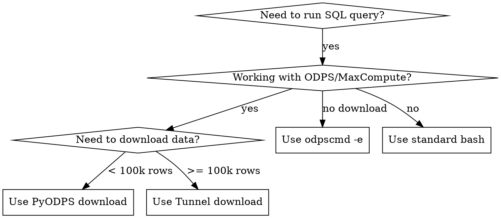

# ODPS SQL Executor

## Overview
A skill for properly executing ODPS SQL commands using odpscmd, with proper syntax and environment handling. Supports SQL execution and data download via PyODPS or Tunnel.

## When to Use


**Use when:**
- Running SQL queries in ODPS/MaxCompute environment
- Executing table operations
- Reading data from ODPS tables
- Creating or modifying ODPS tables
- Running data analysis queries
- **Downloading ODPS data to local files**

**Do NOT use when:**
- Running standard shell commands
- Working with local files (unrelated to ODPS)
- Using other database systems

---

## Part 1: SQL Execution (odpscmd)

### Basic ODPS SQL Execution
```bash
odpscmd -e "SELECT * FROM <table_name>"
```

### Complex Query with Functions
```bash
odpscmd -e "SELECT to_char(<date_column>, 'yyyymmdd') AS <alias_name> FROM <table_name>"
```

### Table Operations
```bash
# Create table
odpscmd -e "CREATE TABLE IF NOT EXISTS <table_name> (...)"

# Insert data
odpscmd -e "INSERT INTO TABLE <target_table> SELECT ... FROM <source_table>"
```

## Quick Reference (SQL)

| Operation | Command Example |
|-----------|-----------------|
| **Simple SELECT** | `odpscmd -e "SELECT * FROM <table_name>"` |
| **COUNT records** | `odpscmd -e "SELECT COUNT(*) FROM <table_name>"` |
| **COUNT DISTINCT** | `odpscmd -e "SELECT COUNT(DISTINCT <column>) FROM <table_name>"` |
| **Create table** | `odpscmd -e "CREATE TABLE IF NOT EXISTS <table_name> (...)"` |
| **Insert with SELECT** | `odpscmd -e "INSERT INTO TABLE <target_table> SELECT * FROM <source_table>"` |
| **JOIN operations** | `odpscmd -e "SELECT a.*, b.* FROM <table_a> a JOIN <table_b> b ON a.id = b.id"` |
| **Date formatting** | `odpscmd -e "SELECT to_char(<date_col>, 'yyyymmdd') FROM <table>"` |

---

## Part 2: Data Download

### Decision Flow

```
检查数据量 → SELECT COUNT(*) FROM <table>
    │
    ├─ < 100,000 行 → PyODPS 下载 (推荐 Excel)
    │
    └─ >= 100,000 行 → Tunnel Download (推荐 Parquet/CSV)
```

### Prerequisites: 获取 AccessKey 和 Endpoint

在执行下载前,需要获取 ODPS 的访问凭证:

1. **AccessKey**: 访问 **https://cc.alibaba-inc.com/iam** → AccessKey 管理
2. **Endpoint**: 根据使用环境自动选择:
   - **海外环境**: `http://service-all.ali-sg-lazada.odps.aliyun-inc.com/api`
   - **国内环境**: `http://service-corp.odps.aliyun-inc.com/api`
3. **Project**: 你的 ODPS 项目名称

#### 环境变量配置 (推荐)

**自动配置方式** - 根据你的默认 shell 自动添加到对应配置文件：

```bash
# 1. 获取你的 AccessKey
# 访问 https://cc.alibaba-inc.com/iam → AccessKey 管理
# 复制你的 AccessKey ID 和 Secret

# 2. 自动检测 shell 并添加配置
SHELL_TYPE=$(basename $SHELL)
RC_FILE="$HOME/.${SHELL_TYPE}rc"

# 追加 ODPS 配置到 ~/.zshrc 或 ~/.bashrc
cat >> "$RC_FILE" << 'EOF'

# ODPS Configuration
export ODPS_ACCESS_ID="<your_access_id>"        # 替换为你的 AccessKey ID
export ODPS_ACCESS_KEY="<your_access_key>"      # 替换为你的 AccessKey Secret
export ODPS_PROJECT="<your_project_name>"       # 替换为你的项目名

# 根据使用环境选择 Endpoint（取消注释其中一个）:
# 海外环境:
export ODPS_ENDPOINT="http://service-all.ali-sg-lazada.odps.aliyun-inc.com/api"
# 国内环境:
# export ODPS_ENDPOINT="http://service-corp.odps.aliyun-inc.com/api"
EOF

# 3. 使配置生效
source "$RC_FILE"

# 4. 验证配置
echo "ODPS_ACCESS_ID: $ODPS_ACCESS_ID"
echo "ODPS_ENDPOINT: $ODPS_ENDPOINT"
```

**手动配置方式** - 将以下内容添加到 `~/.zshrc` 或 `~/.bashrc`:

```bash
# ODPS Configuration
export ODPS_ACCESS_ID="<your_access_id>"        # 从 https://cc.alibaba-inc.com/iam 获取
export ODPS_ACCESS_KEY="<your_access_key>"      # 从 https://cc.alibaba-inc.com/iam 获取
export ODPS_PROJECT="<your_project_name>"       # 你的 ODPS 项目名

# 根据使用环境选择 Endpoint:
# 海外环境:
export ODPS_ENDPOINT="http://service-all.ali-sg-lazada.odps.aliyun-inc.com/api"
# 国内环境 (取消注释并使用):
# export ODPS_ENDPOINT="http://service-corp.odps.aliyun-inc.com/api"
```

**使配置生效:**
```bash
# 如果使用 zsh (默认)
source ~/.zshrc

# 如果使用 bash
source ~/.bashrc
```

**在脚本中使用环境变量:**
```python
import os

access_id = os.environ.get("ODPS_ACCESS_ID")
access_key = os.environ.get("ODPS_ACCESS_KEY")
project = os.environ.get("ODPS_PROJECT")
endpoint = os.environ.get("ODPS_ENDPOINT")
```

### 2.1 PyODPS 下载（< 10 万行）

**适用场景**：数据量较小，需要灵活处理，优先导出为 Excel

```python
from odps import ODPS
import pandas as pd

# 配置连接 - 从环境变量读取 (推荐)
import os

o = ODPS(
    access_id=os.environ.get("ODPS_ACCESS_ID"),        # 从 ~/.zshrc 或 ~/.bashrc 加载
    access_key=os.environ.get("ODPS_ACCESS_KEY"),      # 从 ~/.zshrc 或 ~/.bashrc 加载
    project=os.environ.get("ODPS_PROJECT"),            # 从 ~/.zshrc 或 ~/.bashrc 加载
    endpoint=os.environ.get("ODPS_ENDPOINT"),          # 海外: http://service-all.ali-sg-lazada.odps.aliyun-inc.com/api
                                                       # 国内: http://service-corp.odps.aliyun-inc.com/api
)

# 下载表数据到 DataFrame
table_name = "your_table_name"
df = o.get_table(table_name).to_df().to_pandas()

# 导出为 Excel（优先）
df.to_excel(f"{table_name}.xlsx", index=False, engine='openpyxl')

# 或导出为 Parquet（大数据量备选）
# df.to_parquet(f"{table_name}.parquet", index=False)
```

**安装依赖**：
```bash
pip install pyodps pandas openpyxl
```

### 2.2 Tunnel Download（>= 10 万行）

**适用场景**：大数据量下载，性能更高

#### 方式一：命令行 Tunnel（推荐）

```bash
# 下载为 CSV
odpscmd -e "tunnel download <project_name>.<table_name> <local_file>.csv -h true"

# 下载指定分区
odpscmd -e "tunnel download <project_name>.<table_name> <local_file>.csv -h true -p '<partition_spec>'"

# 下载为其他格式（需后续转换）
odpscmd -e "tunnel download <project_name>.<table_name> <local_file> -h true"
```

**参数说明**：
- `-h true`：包含表头
- `-p '<partition_spec>'`：指定分区，如 `dt='20240101'`
- `-threads <n>`：多线程下载（大数据量时使用）

#### 方式二：PyODPS Tunnel（大数据量）

```python
from odps import ODPS
from odps.tunnel import TableTunnel
import os

# 配置连接 - 从环境变量读取 (推荐)
o = ODPS(
    access_id=os.environ.get("ODPS_ACCESS_ID"),        # 从 ~/.zshrc 或 ~/.bashrc 加载
    access_key=os.environ.get("ODPS_ACCESS_KEY"),      # 从 ~/.zshrc 或 ~/.bashrc 加载
    project=os.environ.get("ODPS_PROJECT"),            # 从 ~/.zshrc 或 ~/.bashrc 加载
    endpoint=os.environ.get("ODPS_ENDPOINT"),          # 海外: http://service-all.ali-sg-lazada.odps.aliyun-inc.com/api
                                                       # 国内: http://service-corp.odps.aliyun-inc.com/api
)

# 使用 Tunnel 下载
tunnel = TableTunnel(o)
download_session = tunnel.create_download_session(
    table_name="<table_name>",
    partition_spec="<partition_spec>"  # 可选，分区表需要
)

# 分批读取（适合大数据量）
with download_session.open_record_reader(0, download_session.count) as reader:
    records = [r for r in reader]

# 转换为 DataFrame
import pandas as pd
df = pd.DataFrame([r.values for r in records], columns=download_session.schema.names)

# 导出
df.to_parquet("<table_name>.parquet", index=False)
# 或
df.to_csv("<table_name>.csv", index=False)
```

### 2.3 下载格式选择指南

| 数据量 | 推荐格式 | 原因 |
|--------|----------|------|
| < 10 万行 | **Excel (.xlsx)** | 易于查看和编辑，兼容性好 |
| 10-100 万行 | **CSV** | 轻量，通用性强 |
| > 100 万行 | **Parquet** | 压缩率高，读取快，支持列式存储 |

### 2.4 完整下载脚本示例

```python
#!/usr/bin/env python3
"""
ODPS 数据下载脚本
使用前请设置环境变量: 
  - ODPS_ACCESS_ID
  - ODPS_ACCESS_KEY
  - ODPS_PROJECT
  - ODPS_ENDPOINT
"""

import os
from odps import ODPS
import pandas as pd

def download_odps_table(table_name: str, output_format: str = "excel"):
    """
    下载 ODPS 表到本地
    
    Args:
        table_name: 表名（不含 project 前缀）
        output_format: 输出格式 - "excel", "csv", "parquet"
    """
    
    # 从环境变量获取凭证（安全实践）
    access_id = os.environ.get("ODPS_ACCESS_ID")
    access_key = os.environ.get("ODPS_ACCESS_KEY")
    project = os.environ.get("ODPS_PROJECT")
    endpoint = os.environ.get("ODPS_ENDPOINT")
    
    missing = [k for k, v in {
        "ODPS_ACCESS_ID": access_id,
        "ODPS_ACCESS_KEY": access_key,
        "ODPS_PROJECT": project,
        "ODPS_ENDPOINT": endpoint
    }.items() if not v]
    
    if missing:
        raise ValueError(f"请设置环境变量: {', '.join(missing)}")
    
    # 连接 ODPS
    o = ODPS(access_id, access_key, project=project, endpoint=endpoint)
    
    # 获取表
    table = o.get_table(table_name)
    row_count = table.size
    
    print(f"表 {table_name} 共有 {row_count:,} 行")
    
    # 根据数据量选择下载方式
    if row_count < 100000:
        print("使用 PyODPS 下载...")
        df = table.to_df().to_pandas()
    else:
        print("数据量较大，建议使用 Tunnel 命令行下载：")
        print(f'  odpscmd -e "tunnel download {project}.{table_name} {table_name}.csv -h true"')
        return
    
    # 导出
    if output_format == "excel":
        output_file = f"{table_name}.xlsx"
        df.to_excel(output_file, index=False, engine='openpyxl')
    elif output_format == "csv":
        output_file = f"{table_name}.csv"
        df.to_csv(output_file, index=False)
    elif output_format == "parquet":
        output_file = f"{table_name}.parquet"
        df.to_parquet(output_file, index=False)
    else:
        raise ValueError(f"不支持的格式: {output_format}")
    
    print(f"已保存到: {output_file}")

if __name__ == "__main__":
    import sys
    
    if len(sys.argv) < 2:
        print("用法: python download_odps.py <table_name> [format]")
        print("format: excel (默认), csv, parquet")
        sys.exit(1)
    
    table_name = sys.argv[1]
    output_format = sys.argv[2] if len(sys.argv) > 2 else "excel"
    
    download_odps_table(table_name, output_format)
```

---

## Implementation

### Environment Setup

通过环境变量或 `odps_config.ini` 配置你的 ODPS 连接信息：
- `project`: 你的 MaxCompute 项目名
- `access_id`: AccessKey ID
- `access_key`: AccessKey Secret
- `endpoint`: MaxCompute Endpoint

### Prerequisites Check

Before executing ODPS SQL commands, verify `odpscmd` is available:

```bash
# Check if odpscmd is installed
which odpscmd
```

**If `odpscmd` is not found, install the ODPS client:**

#### Installation Steps:

1. **Download MaxCompute Client**
   - GitHub: https://github.com/aliyun/aliyun-odps-console/releases (download `odpscmd_public.zip`)
   - OSS (if GitHub fails): https://maxcompute-repo.oss-cn-hangzhou.aliyuncs.com/odpscmd/latest/odpscmd_public.zip

2. **Extract and Configure**
   ```bash
   # Extract the zip file
   unzip odpscmd_public.zip
   
   # Navigate to conf directory
   cd odpscmd_public/conf
   
   # Edit odps_config.ini with your project settings
   # Required parameters:
   # - project_name: your MaxCompute project name
   # - access_id: AccessKey ID (from https://cc.alibaba-inc.com/iam)
   # - access_key: AccessKey Secret (from https://cc.alibaba-inc.com/iam)
   # - end_point: MaxCompute Endpoint
   # Optional parameters:
   # - log_view_host: http://logview.odps.aliyun.com (recommended for debugging)
   # - use_instance_tunnel: true
   # - instance_tunnel_max_record: 10000
   ```

3. **Add to PATH** (optional but recommended)
   ```bash
   # Add odpscmd to PATH for easy access
   export PATH=$PATH:/path/to/odpscmd_public/bin
   ```

4. **Verify Installation**
   ```bash
   # Start odpscmd interactive mode
   cd odpscmd_public/bin
   ./odpscmd
   
   # Or execute commands directly
   ./odpscmd -e "SELECT COUNT(*) FROM <table_name>;"
   ```

**Important**: If `odpscmd` command not found, prompt the user to install the ODPS client tool before proceeding with any SQL execution.

### Common Query Patterns

**Data Exploration:**
```bash
# Check table structure
odpscmd -e "DESC <table_name>"

# Check data volume
odpscmd -e "SELECT COUNT(*) FROM <table_name>"

# Sample data
odpscmd -e "SELECT * FROM <table_name> LIMIT 10"
```

**Data Analysis:**
```bash
# Distribution analysis
odpscmd -e "SELECT <column_name>, COUNT(*) FROM <table_name> GROUP BY <column_name>"

# Join operations for analysis
odpscmd -e "SELECT a.<column_a>, b.<column_b> FROM <table_a> a LEFT JOIN <table_b> b ON a.<join_key> = b.<join_key>"
```

---

## Common Mistakes

| Mistake | Fix |
|---------|-----|
| Forgetting quotes around SQL | Always wrap SQL in double quotes: `odpscmd -e "SELECT ..."` |
| Not using IF NOT EXISTS for CREATE | Use `CREATE TABLE IF NOT EXISTS` to avoid errors |
| Missing semicolons in complex queries | Add semicolons between statements in multi-statement queries |
| Forgetting COUNT DISTINCT for unique records | Use `COUNT(DISTINCT column)` for unique counts |
| 硬编码 AccessKey | 使用环境变量或配置文件，从 https://cc.alibaba-inc.com/iam 获取 |
| 大数据量用 PyODPS 下载超时 | 改用 Tunnel 命令行或分批下载 |
| Excel 导出大数据量失败 | 大于 100 万行改用 CSV 或 Parquet |

---

## Real-World Impact

Based on past sessions, proper ODPS SQL execution:
- Enables efficient data exploration of large datasets
- Supports complex join operations for data analysis
- Facilitates table creation and data insertion workflows
- Provides consistent query execution across sessions
- **Enables safe and efficient data download with appropriate methods**

---

## Best Practices

1. **Always wrap SQL queries in double quotes**
2. **Use `IF NOT EXISTS` for table creation**
3. **Prefer `COUNT(DISTINCT)` for unique record counts**
4. **Use proper date formatting with `to_char()`**
5. **Test complex queries in parts before full execution**
6. **Use LIMIT for initial data exploration**
7. **下载前先检查数据量**：`SELECT COUNT(*)`
8. **小数据量优先 Excel，大数据量用 Tunnel**
9. **AccessKey 从 https://cc.alibaba-inc.com/iam 获取，不要硬编码**
10. **使用环境变量配置项目名和 Endpoint，保持通用性**

---

## Error Handling

- Check table exists before querying: `SHOW TABLES LIKE '<table_name>'`
- Verify column names with `DESC <table_name>`
- Use proper partition syntax for partitioned tables
- Handle NULL values in joins and calculations
- If `odpscmd` command not found, install ODPS client first
- PyODPS 下载超时 → 改用 Tunnel 命令行
- Excel 导出内存不足 → 改用 CSV 或 Parquet
